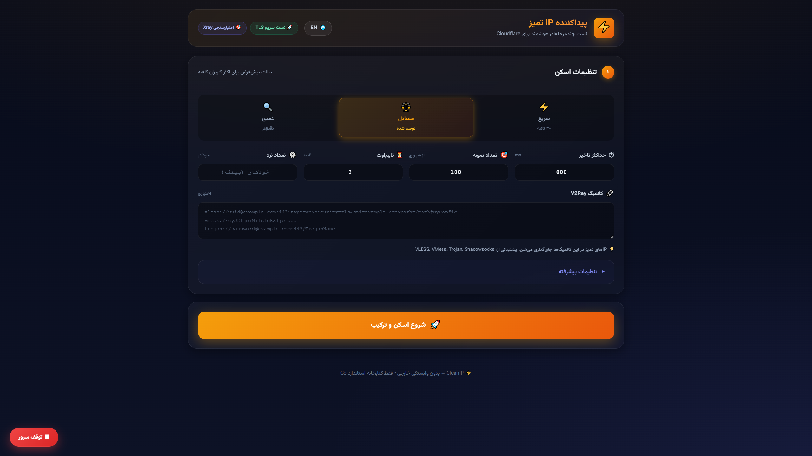
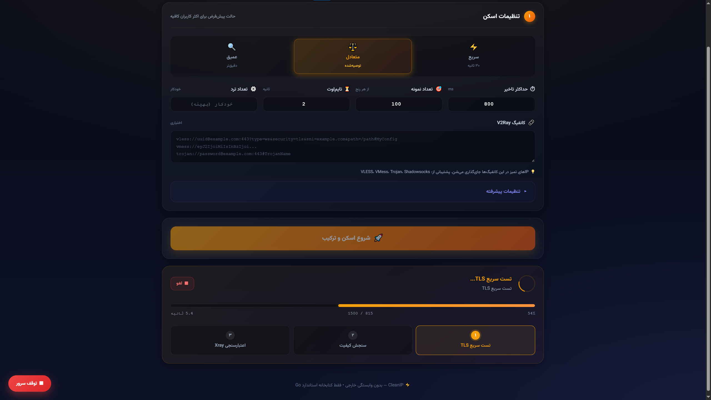
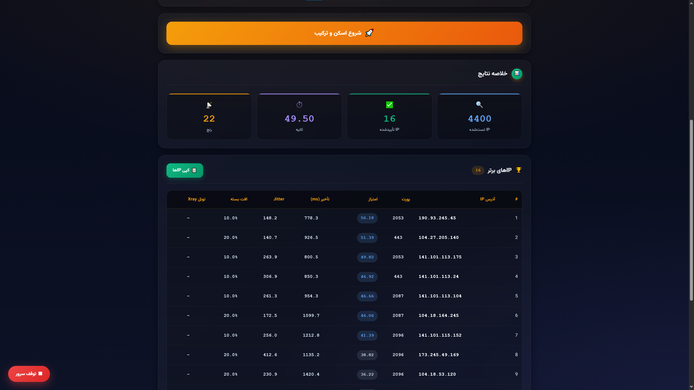
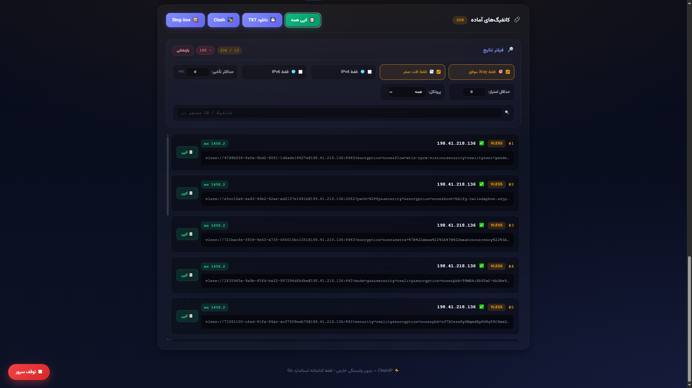

<div align="center">

# ⚡ CleanIP

### پیداکننده‌ی IP تمیز Cloudflare

**Smart multi-stage Cloudflare clean-IP finder**

[](https://go.dev/dl/)
[](LICENSE)
[](../../releases)
[]()

**ساخته‌شده با ❤️ توسط [میثم خادم شمس](https://github.com/khademdev)**

</div>

---

## 🇮🇷 فارسی

### این چیه؟

**CleanIP** یه ابزار سبک و سریع برای پیدا کردن **IP تمیز Cloudflare** هست.

به جای اینکه خودت ساعت‌ها IP تست کنی، این ابزار به صورت خودکار:

1. **تست سریع TLS** — 20,000 IP رو در چند ثانیه غربال می‌کنه
2. **سنجش کیفیت** — تأخیر، Jitter، افت بسته رو دقیق اندازه می‌گیره
3. **تست تونل واقعی Xray** — IPهایی که تأیید شدن رو با یه کانفیگ واقعی چک می‌کنه

### ✨ ویژگی‌ها

- 🚀 **تست موازی** — تا 2000 worker همزمان
- 🎯 **پشتیبانی از VLESS، VMess، Trojan، Shadowsocks**
- 📊 **محاسبه دقیق** تأخیر، Jitter، افت بسته و سرعت دانلود
- 🧩 **Smart Fragment** — عبور از DPI ایران
- 🔐 **ECH** (Encrypted Client Hello)
- 🌐 **IPv4 + IPv6**
- 🌍 **رابط دوزبانه** (فارسی + انگلیسی)
- 🧠 **تاریخچه‌ی اختیاری** — هیچ داده‌ای بدون اجازه ذخیره نمی‌شه
- 📦 **بدون وابستگی** — فقط کتابخانه استاندارد Go
- 🖥️ **بدون پنجره کنسول** روی ویندوز

### 📥 دانلود

از صفحه [Releases](../../releases) آخرین نسخه رو بگیرید:

| پلتفرم | فایل |
|--------|------|
| ویندوز | `cleanip.exe` |
| لینوکس | `cleanip-linux` |
| مک | `cleanip-macos` |

> ⚠️ **هشدار ویندوز:** اگه SmartScreen پیام داد، روی **More info** بعد **Run anyway** کلیک کنید.

### 🚀 شروع سریع

1. فایل رو دانلود و اجرا کنید
2. **مرورگر خودکار باز می‌شه** → `http://localhost:8080`
3. **کانفیگ V2Ray خودتون رو پیست کنید** (اختیاری)
4. یکی از سه حالت رو انتخاب کنید:
   - **⚡ سریع** (~30 ثانیه) — تست روزمره
   - **⚖️ متعادل** (~2 دقیقه) — توصیه‌شده
   - **🔍 عمیق** (~5 دقیقه) — تست کامل
5. دکمه **شروع اسکن** رو بزنید
6. نتیجه رو به فرمت TXT / Clash / Sing-box دانلود کنید

### 🔒 حریم خصوصی

- ✅ **بدون telemetry** — هیچ داده‌ای به بیرون فرستاده نمی‌شه
- ✅ همه ترافیک روی `127.0.0.1` می‌مونه
- ✅ **تاریخچه opt-in** — هیچ فایلی خودکار ذخیره نمی‌شه
- ✅ فقط با Cloudflare APIs تماس می‌گیره (برای تست)

### 🧩 Xray (اختیاری)

برای فعال شدن تست تونل واقعی:

1. از [Xray-core releases](https://github.com/XTLS/Xray-core/releases) فایل `xray.exe` رو دانلود کنید
2. یه پوشه به اسم `xray_core` کنار `cleanip.exe` بسازید
3. فایل `xray.exe` رو داخلش بذارید

بدون Xray، برنامه باز کار می‌کنه ولی فقط تست TLS و کیفیت اجرا می‌شه.

---

## 🇬🇧 English

### What is this?

**CleanIP** is a lightweight tool that finds **clean Cloudflare IPs** using a multi-stage scan pipeline:

1. **Fast TLS test** — filters 20,000 IPs in seconds
2. **Quality measurement** — accurate latency, jitter, and packet loss
3. **Real Xray tunnel validation** — tests verified IPs with an actual config

### ✨ Features

- 🚀 **Parallel testing** — up to 2000 concurrent workers
- 🎯 **VLESS, VMess, Trojan, Shadowsocks** support
- 📊 **Accurate** latency, jitter, packet loss, and download speed
- 🧩 **Smart Fragment** — bypass Iranian DPI
- 🔐 **ECH** (Encrypted Client Hello)
- 🌐 **IPv4 + IPv6**
- 🌍 **Bilingual UI** (Persian + English)
- 🧠 **Opt-in history** — nothing stored without consent
- 📦 **Zero external dependencies** — Go stdlib only
- 🖥️ **No console window** on Windows

### 📥 Download

Grab the latest binary from [Releases](../../releases):

| Platform | File |
|----------|------|
| Windows  | `cleanip.exe` |
| Linux    | `cleanip-linux` |
| macOS    | `cleanip-macos` |

> ⚠️ **Windows warning:** If SmartScreen blocks it, click **More info** → **Run anyway**.

### 🚀 Quick Start

1. Download and run the binary
2. **Browser opens automatically** → `http://localhost:8080`
3. **Paste your V2Ray config** (optional)
4. Pick a preset:
   - **⚡ Fast** (~30 s) — daily use
   - **⚖️ Balanced** (~2 min) — recommended
   - **🔍 Deep** (~5 min) — full sweep
5. Hit **Start Scan**
6. Download results as TXT / Clash / Sing-box

### 🔒 Privacy

- ✅ **No telemetry** — nothing leaves your machine
- ✅ All traffic stays on `127.0.0.1`
- ✅ **History is opt-in** — no file written by default
- ✅ Only calls Cloudflare public APIs (for testing)

### 🧩 Xray (Optional)

To enable real tunnel validation:

1. Download `xray.exe` from [Xray-core releases](https://github.com/XTLS/Xray-core/releases)
2. Create a folder named `xray_core` next to `cleanip.exe`
3. Place `xray.exe` inside it

Without Xray, the tool still works but runs only TLS and quality tests.

---
## 📸 Screenshots

### رابط کاربری اصلی


### در حال اسکن


### جدول نتایج


### کانفیگ‌های آماده


## 🛠️ Build from Source

### Requirements

- [Go 1.21+](https://go.dev/dl/)

### Build

```bash
# Linux / macOS
make build

# Windows
build.bat
```

Or manually:

```bash
# Windows (no console window)
CGO_ENABLED=0 GOOS=windows GOARCH=amd64 go build -trimpath -ldflags="-s -w -H windowsgui" -o cleanip.exe .

# Linux / macOS
CGO_ENABLED=0 go build -trimpath -ldflags="-s -w" -o cleanip .
```

---

## 📁 Project Structure

```
cleanip/
├── main.go              # HTTP server + scan logic
├── index.html           # UI (embedded)
├── style.css            # Styles (embedded)
├── proc_windows.go      # hideWindow for Windows
├── proc_other.go        # hideWindow for others
├── go.mod
├── Makefile
├── build.bat / build.sh
└── .github/workflows/   # CI/CD
```

---

## 🤝 Contributing

Pull requests welcome! See [CONTRIBUTING.md](CONTRIBUTING.md).

## 🔐 Security

Found a vulnerability? See [SECURITY.md](SECURITY.md).

## 📄 License

MIT — see [LICENSE](LICENSE).

Copyright © 2025 **Meysam Khademshams (میثم خادم شمس)**

## 🙏 Credits

- IP ranges from [Cloudflare's official API](https://api.cloudflare.com/client/v4/ips)
- Tunnel testing via [Xray-core](https://github.com/XTLS/Xray-core)
- Persian font: [Vazirmatn](https://github.com/rastikerdar/vazirmatn)

<div align="center">

**⭐ If this helped you, please star the repo! ⭐**

Made with ❤️ by [Meysam Khademshams](https://github.com/khademdev)

</div>

---

## 🏷️ Keywords / کلمات کلیدی

**English:** `Cloudflare` · `Clean IP` · `V2Ray` · `Xray` · `VLESS` · `VMess` · `Trojan` · `Shadowsocks` · `Iran` · `DPI Bypass` · `Proxy` · `Anti-Censorship` · `Free Config` · `IP Scanner` · `Network Tool`

**فارسی:** آی پی تمیز · کلادفلر · پروکسی · عبور از فیلترینگ · دور زدن DPI · کانفیگ آماده · v2ray فارسی · xray فارسی · اسکنر شبکه

<!--
SEO keywords (hidden, for GitHub search indexing):
پیدا کردن آی پی تمیز کلادفلر
آی پی تمیز برای وی پی ان
بهترین آی پی کلادفلر
آی پی کلادفلر برای ایران
پروکسی کلادفلر
تست آی پی
اسکنر آی پی
عبور از فیلترینگ
دور زدن DPI
کانفیگ آماده رایگان
-->
